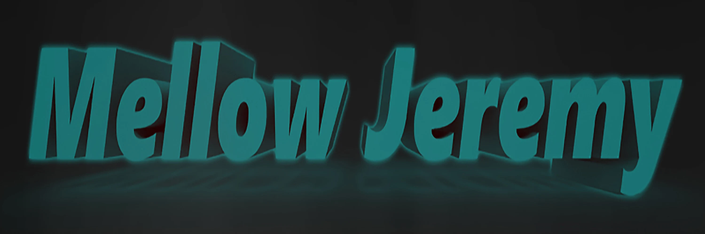

## [Discography](./discography/)

<!--
**mellowjeremy/mellowjeremy** is a ✨ _special_ ✨ repository because its `README.md` (this file) appears on your GitHub profile.

Here are some ideas to get you started:

- 🔭 I’m currently working on ...
- 🌱 I’m currently learning ...
- 👯 I’m looking to collaborate on ...
- 🤔 I’m looking for help with ...
- 💬 Ask me about ...
- 📫 How to reach me: ...
- 😄 Pronouns: ...
- ⚡ Fun fact: ...
-->

### Latest Release
**[This Time (2025)](./discography/this-time.md)**
*Released June 2025*

---
## ⚖️ Licensing
The website structure and Markdown code in this repository are licensed under the [MIT License](./LICENSE).

**All music, album artwork, and audio content are © 2026 Mellow Jeremy.**
*Unless otherwise noted, audio content is provided for personal listening only and is licensed under [All Rights Reserved]*
