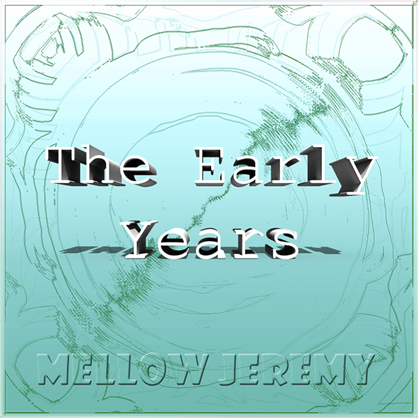

---
---

## The Early Years (2016)

**Genre:** Electronic / Techno
**Release Date:** January 1, 2016
**Label:** Mellow Jeremy Recordings

### 💿 Tracklist

| # | Title | Time | Listen |
| :--- | :--- |: ---| :--- |
| 1 | At It | 04:07 | [Listen](https://mellowjeremy.bandcamp.com/track/at-it) |
| 2 | Hot Spot | 07:16 | [Listen](https://mellowjeremy.bandcamp.com/track/hot-spot) |
| 3 | Sun Ride | 04:24 | [Listen](https://mellowjeremy.bandcamp.com/track/sun-ride) |
| 4 | Side Step | 07:19 | [Listen](https://mellowjeremy.bandcamp.com/track/side-step) |
| 5 | Whisper | 07:16 | [Listen](https://mellowjeremy.bandcamp.com/track/whisper) |
| 6 | Got That Break | 04:13 | [Listen](https://mellowjeremy.bandcamp.com/track/got-that-break) |
| 7 | 2 Day | 05:06 | [Listen](https://mellowjeremy.bandcamp.com/track/2-day) |
| 8 | Faster | 07:53 | [Listen](https://mellowjeremy.bandcamp.com/track/faster) |
| 9 | Deep Box | 05:52 | [Listen](https://mellowjeremy.bandcamp.com/track/deep-box) |
| 10 | Aliens | 04:11 | [Listen](https://mellowjeremy.bandcamp.com/track/aliens) |
| 11 | Exo | 05:31 | [Listen](https://mellowjeremy.bandcamp.com/track/exo) |
| 12 | How Many | 04:06 | [Listen](https://mellowjeremy.bandcamp.com/track/how-many) |
| 13 | Extra | 07:18 | [Listen](https://mellowjeremy.bandcamp.com/track/extra) |
| 14 | Up Time | 05:38 | [Listen](https://mellowjeremy.bandcamp.com/track/up-time) |
| 15 | Trades | 04:37 | [Listen](https://mellowjeremy.bandcamp.com/track/trades) |
| 16 | I Got Love | 05:17 | [Listen](https://mellowjeremy.bandcamp.com/track/i-got-love) |
| 17 | Rendition | 05:30 | [Listen](https://mellowjeremy.bandcamp.com/track/rendition) |
| 18 | State of Intuition | 06:24 | [Listen](https://mellowjeremy.bandcamp.com/track/state-of-intuition) |
| 19 | Realize | 04:23 | [Listen](https://mellowjeremy.bandcamp.com/track/realize) |
| 20 | Tin | 04:38 | [Listen](https://mellowjeremy.bandcamp.com/track/tin) |
| 21 | Layers | 09:55 | [Listen](https://mellowjeremy.bandcamp.com/track/layers) |
| 22 | Free Fall | 09:16 | [Listen](https://mellowjeremy.bandcamp.com/track/free-fall) |
| 23 | Cruncher | 04:02 | [Listen](https://mellowjeremy.bandcamp.com/track/cruncher) |
| 24 | Boards | 05:09 | [Listen](https://mellowjeremy.bandcamp.com/track/boards) |
| 25 | Deeper Sound | 05:03 | [Listen](https://mellowjeremy.bandcamp.com/track/deeper-sound) |
| 26 | Deeper Sound Part 2 | 08:49 | [Listen](https://mellowjeremy.bandcamp.com/track/deeper-sound-part-2) |
| 27 | Coating | 04:54 | [Listen](https://mellowjeremy.bandcamp.com/track/coating) |
| 28 | I Got Love (Remix) | 05:13 | [Listen](https://mellowjeremy.bandcamp.com/track/i-got-love-remix) |
| 29 | Rhythm Player | 10:20 | [Listen](https://mellowjeremy.bandcamp.com/track/rhythm-player) |
| 30 | 21st Century | 13:32 | [Listen](https://mellowjeremy.bandcamp.com/track/21st-century) |

[⬅ Back to Discography](./README.md)

